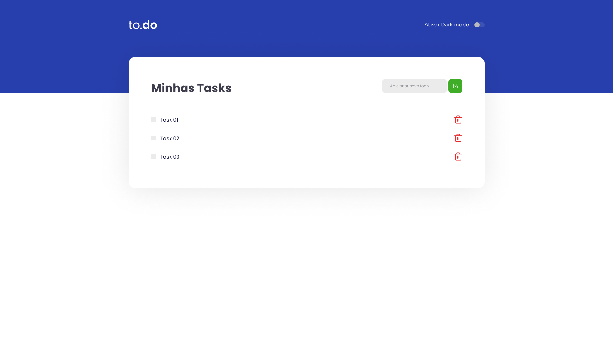

## to.do

Esse é um projeto desenvolvido no [Ignite](https://rocketseat.com.br/ignite) da [Rocketseat](https://rocketseat.com.br/) utilizando React, TypeScript e Sass. Como eu sou EU, óbvio que fiz uma modificação no projeto original, implementei um darkmode e adicionei responsivo para todos os dispositivos móveis

---

## Preview

<p align="center">  </p>

---

## Tecnologias

- [ReactJS](https://reactjs.org/)
- [TypeScript](https://www.typescriptlang.org/)
- [Sass](https://sass-lang.com/)

---

### **Iniciando o projeto**

```bash
# Você precisa ter node na sua máquina para rodar o projeto
# Não lembra se possui o node? Execute node -v no seu terminal
$ node -v

# Execute yarn install para instalar as dependências
$ yarn install

# Execute npm start para iniciar a aplicação 
$ yarn dev

# A página será aberta em localhost na porta indicada no seu terminal (:

```

---

Idealizado por [Rocketseat](https://rocketseat.com.br/) e adaptado por [Alexandre Shyjada](https://www.alexshyjada.com/) 😎
